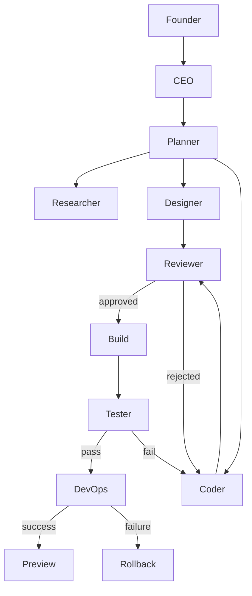

# Agent Architecture

## Purpose

Specify every agent role in the LangGraph orchestration layer: its
responsibilities, state, retry policy, and human override points.

## Scope

The agent graph and its nodes. The workflows those agents execute are
documented separately in `workflows/`, particularly
`workflows/Multi-Agent-Orchestration.md`.

## Agent Roles

**CEO** — Responsibilities: hold and clarify founder intent, resolve
ambiguity by asking the founder rather than guessing, approve or reject the
Planner's task breakdown at a high level. State: founder intent, project
goals, approval history. Retry Policy: does not retry — escalates
ambiguity to a human question instead. Human Override: founder can always
override or correct stated intent.

**Planner** — Responsibilities: turn approved intent into an ordered task
graph with dependencies. State: task list, dependency graph, current task
pointer. Retry Policy: up to 2 retries on invalid task graph before
escalating to CEO. Human Override: founder can reorder, add, or remove tasks.

**Coder** — Responsibilities: implement a single task against the locked tech
stack, using the Git Engine to create/update files. State: current task,
working diff, affected files. Retry Policy: up to 3 retries on build/test
failure before escalating to Reviewer. Human Override: founder can edit the
diff directly before it is committed.

**Designer** — Responsibilities: produce UI/UX specifications and design-token
usage for a task, consumed by the Coder. State: current task, design spec,
token usage. Retry Policy: up to 2 retries on Reviewer rejection. Human
Override: founder can request a different design direction.

**Researcher** — Responsibilities: gather external information (docs, APIs,
best practices) needed by Planner or Coder. State: research query, findings.
Retry Policy: retries with a narrowed query on empty/low-confidence results.
Human Override: founder can supply source material directly.

**Reviewer** — Responsibilities: gate Coder and Designer output against
quality, security, and consistency criteria before it proceeds to Build.
State: current diff/spec under review, pass/fail verdict, comments. Retry
Policy: rejects back to Coder/Designer up to 3 times before escalating to
CEO. Human Override: founder can force-approve or force-reject.

**Tester** — Responsibilities: run automated tests against a build and report
pass/fail with detail. State: test suite results, coverage delta. Retry
Policy: reruns flaky failures once before treating as a real failure. Human
Override: founder can mark a failure as accepted/known.

**DevOps** — Responsibilities: execute the Deploy workflow, monitor the
result, and trigger rollback on failure. State: deployment target, deploy
status, health-check results. Retry Policy: one automatic retry on
transient deploy failure, then escalates. Human Override: founder can
approve, delay, or force a rollback.

## Orchestration Graph

## Dependencies

- `workflows/Multi-Agent-Orchestration.md`
- `architecture/Memory-Architecture.md` (state persistence per agent)

## Future Work

- Formal agent-to-agent message schema
- Cost/latency budget per agent role

## References

- `decisions/ADR-004-LangGraph.md`
- `prompts/` (system prompts implementing each role)
