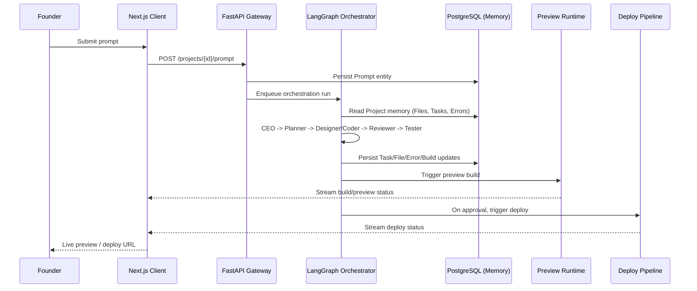

# Data Flow

## Purpose

Trace how a single founder request moves through the entire system, tying
together the Frontend, Backend, Agent, and Memory architectures.

## Scope

The canonical happy-path data flow for "founder submits a prompt to
completed deploy." Error paths are covered in
`workflows/Error-Recovery-Workflow.md`.

## Flow

## Dependencies

- `architecture/Agent-Architecture.md`
- `architecture/Memory-Architecture.md`
- `architecture/Runtime-Architecture.md`

## Future Work

- Data flow diagram for the error-recovery path
- Data flow diagram for multi-project (Brand-level) operations

## References

- `architecture/System-Architecture.md`
