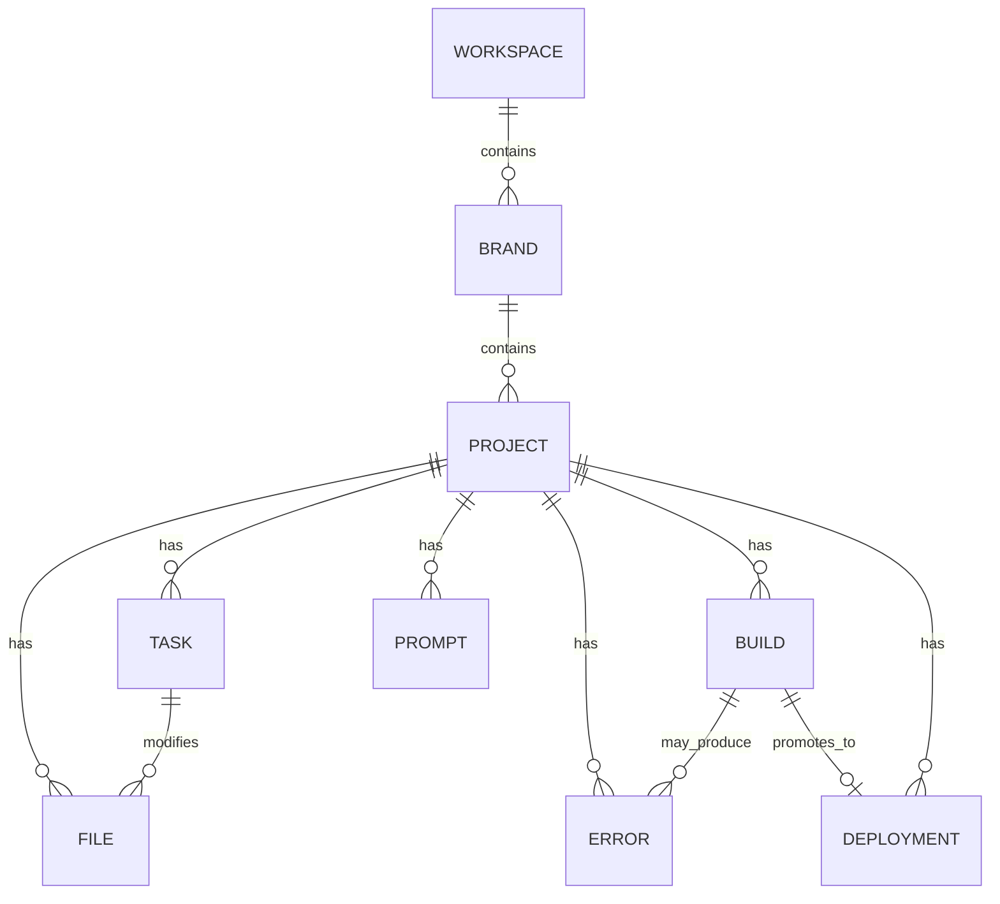

# Memory Architecture

## Purpose

Define how project state and history are structured and persisted so any
agent, or the founder, can reconstruct full project context at any time.

## Scope

The logical memory hierarchy and its entity relationships. Physical schema
(tables, indexes) is Phase 1 work informed by this document.

## Hierarchy

```
Workspace
 └── Brand
      └── Project
           ├── Files
           ├── Tasks
           ├── Prompts
           ├── Errors
           ├── Builds
           └── Deployments
```

A **Workspace** belongs to a founder (or team, in a future multi-seat model).
A Workspace contains one or more **Brands** (e.g. distinct product lines). A
Brand contains one or more **Projects**. Each Project owns its own Files,
Tasks, Prompts (the history of founder + agent prompts that shaped it),
Errors (captured failures and their resolutions), Builds, and Deployments.

## Entity Relationship Diagram



## Dependencies

- `architecture/Backend-Architecture.md`
- `architecture/Agent-Architecture.md` (per-agent state persistence)

## Future Work

- Physical PostgreSQL schema and migration plan
- Retention/archival policy for Errors and Builds

## References

- `architecture/Data-Flow.md`
