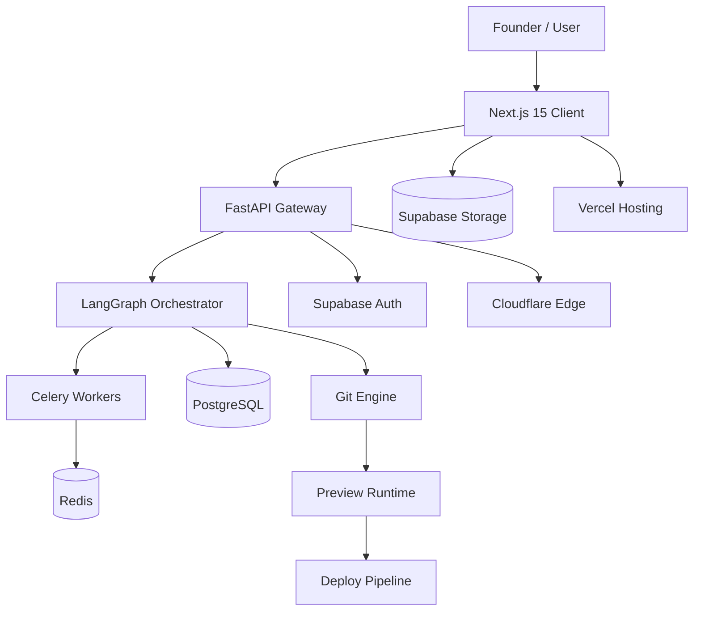

# System Architecture

## Purpose

Describe the end-to-end shape of AI CEO Studio: the major subsystems and how
they connect, as the single diagram every other architecture document zooms
into.

## Scope

System-level only. Frontend internals, backend internals, and agent internals
are each covered in their own documents.

## Overview

AI CEO Studio has four macro subsystems: the **Client** (Next.js app), the
**API Gateway** (FastAPI), the **Orchestration Layer** (LangGraph agent
graph, backed by Celery workers and Redis), and the **Persistence Layer**
(PostgreSQL + Supabase Storage). Cloudflare sits in front as edge/CDN, Vercel
hosts the Next.js app, and the FastAPI service runs in Docker containers
behind it.

## Dependencies

- All nine documents in `architecture/`
- `workflows/Multi-Agent-Orchestration.md`

## Future Work

- Multi-region deployment topology
- Horizontal scaling plan for the Orchestration Layer

## References

- `architecture/Runtime-Architecture.md`
- `architecture/Deployment-Architecture.md`
