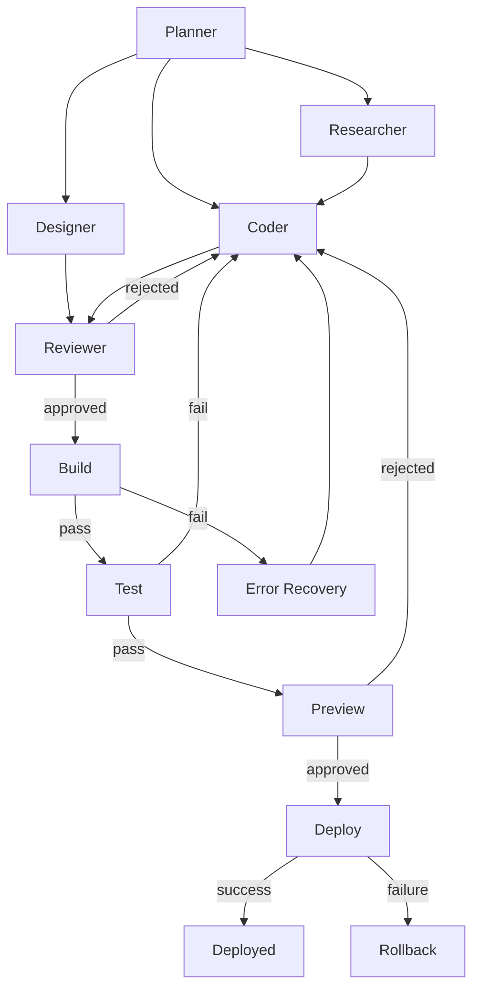

# Multi-Agent Orchestration Workflow

The full LangGraph orchestration specification tying together every agent
defined in `architecture/Agent-Architecture.md`.

## Trigger

An approved Task graph from `workflows/Planning-Workflow.md`.

## Input

- Task graph
- Project memory (per `architecture/Memory-Architecture.md`)

## Output

- Completed, reviewed, tested, and (on approval) deployed Project changes

## Orchestration Graph

## Decision Gates

Every gate defined individually in `workflows/Planning-Workflow.md` through
`workflows/Deploy-Workflow.md` applies here; this document is the composed
view, not a separate set of rules.

## Human Approval Points

Aggregated from each stage: intent confirmation, task graph approval, diff
review (optional), preview approval, deploy approval.

## Rollback Strategy

Each stage's own rollback strategy applies locally; at the orchestration
level, a failure at any stage returns control to the Coder or to the founder,
never silently continuing past a failed gate.

## References

- `architecture/Agent-Architecture.md`
- All other `workflows/` documents
